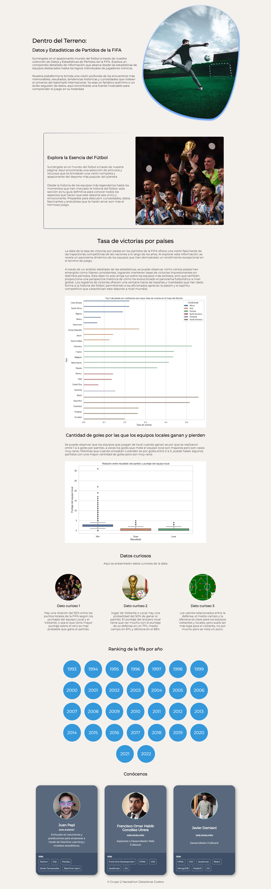

# Proyecto Hackathon: Dentro del terreno

## Equipo 2: DataVerse Coders

## Descripción general

- Introducción
- Vistas previas del proyecto
- Autores

## Introducción

Este proyecto es el resultado del trabajo en equipo de las carreras Desarrollo Web y Data Scientist del bootcamp **TripeTen** que estamos cursando actualmente, en donde aplicamos nuestros conocimientos del lado del desarrollo web: flex-box, Grid Layout, metodología bem, transiciones, animaciones, buena maquitación, media queries y JavaScrip, y para el analisis de los datos se utilizó: python, notebook de pandas al igual que VS Code,
los metodos aplicados fuero EDA (Analisis explotario de datos), visualizaciones con seaborn.

## Vistas previas del proyecto

### Vista diseño pc

### Vista diseño para tablets

### Vista diseño para dispositivos móviles

### Autores

#### Integrantes Desarrollo Web

Javier Damiani

Francisco Omar Habib González Utrera

#### Integrantes Data Scientist

Juan Papi
